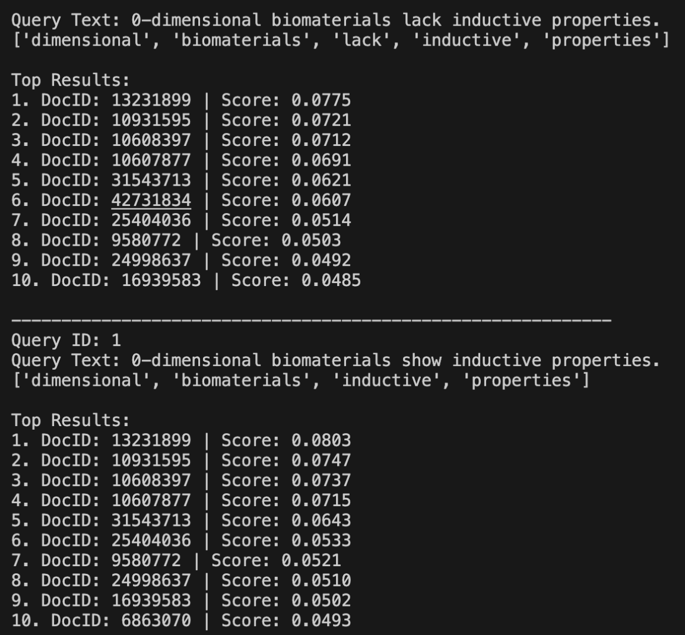
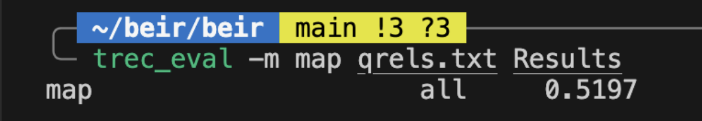

# Assignment 1 — Information Retrieval System

**Course:** CSI4107 – Internet Retrieval  
**Assignment:** 1 – Information Retrieval System (Vector Space Model)  
**Group Members:**  
- Cedric Luiz Dimatulac: 
- Joseph Sreih: 300290385
- Tanner Frisch: 300294742  

**Division of Tasks:**  
- Cedric: Step 1 - Preprocessing
- Tanner: Step 2 - Indexing
- Joseph: Step 3 - Retrieval and Ranking

---

## 1. Program Functionality

This project implements an Information Retrieval (IR) system for the SciFact dataset. The system performs the following tasks:

1. **Preprocessing**  
   - Tokenization of documents  
   - Stopword removal using provided stopword list  
   - Filtering of punctuation, numbers, and markup  

2. **Indexing (Step 2)**  
   - Create an inverted index: each term maps to a dictionary of document IDs and term frequencies  
   - Compute document frequency for each term for later use
   - Track the total number of documents in the corpus  

3. **Retrieval & Ranking (Step 3)**
   - Use inverted index to find a query word
   - Computes cosine similarity between queries and documents  
   - Produces ranked results for test queries  

---

## 2. How to Run

**Requirements:** Python 3.x, SciFact dataset in `datasets/scifact/`  

### 

```bash
python main.py
```

---

## Algorithms, Data Structures, and Results

### Step 1 — Preprocessing
**Algorithm:**  
- Tokenize text into lowercase words using regex `[a-z]+`.  
- Remove stopwords using a provided stopword list.  

**Data structures:**  
- Input: string (document text)  
- Output: list of tokens (Python list)  

**Optimizations:**  
- Stopwords stored as a set for O(1) lookups.

**Results:**
```bash
Document ID: 4983
First 30 tokens:
['microstructural', 'development', 'human', 'newborn', 'cerebral', 'white', 'matter', 'assessed', 'vivo', 'diffusion', 'tensor', 'magnetic', 'resonance', 'imaging', 'alterations', 'architecture', 'cerebral', 'white', 'matter', 'developing', 'human', 'brain', 'affect', 'cortical', 'development', 'result', 'functional', 'disabilities', 'line', 'scan'] 
Total tokens: 168
```

### Step 2 - Indexing
**Algorithm:**  
1. Read each document from `corpus.jsonl`.  
2. Preprocess text with Step 1.  
3. For each token, add to inverted index:  
   - `inverted_index[token][doc_id] = term frequency`  
   - Track document frequency for each token.  

**Data structures:**  
- **Inverted index:** dict of dicts  
```python
inverted_index = {
    "token": {"document_x": 2, "document_y": 1},
}
```

**Optimizations:**
- Each document ID is stored only once per token using a Counter, which prevents duplicates.
- inverted index (dict of dicts) allows fast lookup and updates of term frequencies.
- document_freq tracks how many documents contain each token.

**Results:**

```python
Vocabulary size: 29953
Sample 100 tokens:
['microstructural', 'development', 'human', 'newborn', 'cerebral', 'white', 'matter', 'assessed', 'vivo', 'diffusion', 'tensor', 'magnetic', 'resonance', 'imaging', 'alterations', 'architecture', 'developing', 'brain', 'affect', 'cortical', 'result', 'functional', 'disabilities', 'line', 'scan', 'weighted', 'mri', 'sequence', 'analysis', 'applied', 'measure', 'apparent', 'coefficient', 'calculate', 'relative', 'anisotropy', 'delineate', 'dimensional', 'fiber', 'preterm', 'full', 'term', 'infants', 'assess', 'effects', 'prematurity', 'early', 'gestation', 'studied', 'central', 'mean', 'wk', 'microm', 'decreased', 'posterior', 'limb', 'internal', 'capsule', 'coefficients', 'versus', 'closer', 'birth', 'absolute', 'values', 'areas', 'compared', 'nonmyelinated', 'fibers', 'corpus', 'callosum', 'visible', 'marked', 'differences', 'organization', 'data', 'indicate', 'quantitative', 'assessment', 'water', 'insight', 'living', 'induction', 'myelodysplasia', 'myeloid', 'derived', 'suppressor', 'cells', 'myelodysplastic', 'syndromes', 'mds', 'age', 'dependent', 'stem', 'cell', 'malignancies', 'share', 'biological', 'features', 'activated', 'adaptive']

Posting list for token 'claim':
{'5921065': 1, '17991818': 1, '27768226': 2, '41298619': 1}
Appears in 4 documents
```

### Step 3 - Retrieval and Ranking
**Algorithm**  
1. Compute cosine similarity between queries and candidate documents
2. Generate ranked list for each test query
3. Output results in ```Results``` file

**Data structures**
Input: String of text known as the query
Output: A List of tuples containing (doc_id, cosine_score)

## Results
- First 10 answers for first 2 queries

- These queries are interesting because they show us the reality of documents and queries. Most queries are small Compared to the documents that they query. Large documents create large documents norms, which in turn make the cosine similiarty score appear very small. Even so, a small Cosine Similarity does not always mean that the document is not relevant, like the 2 cases above.

---

## Query Using Titles Only

The retrieval system is evaluated using only document titles.


- Even though the querying on the titles scores higher cosine similiarity scores (due to a low document norm), it is no where near as effective as using the title and the text for finding related documents. 

---

## MAP Score (trec_eval)

The Mean Average Precision (MAP) computed using `trec_eval`:


