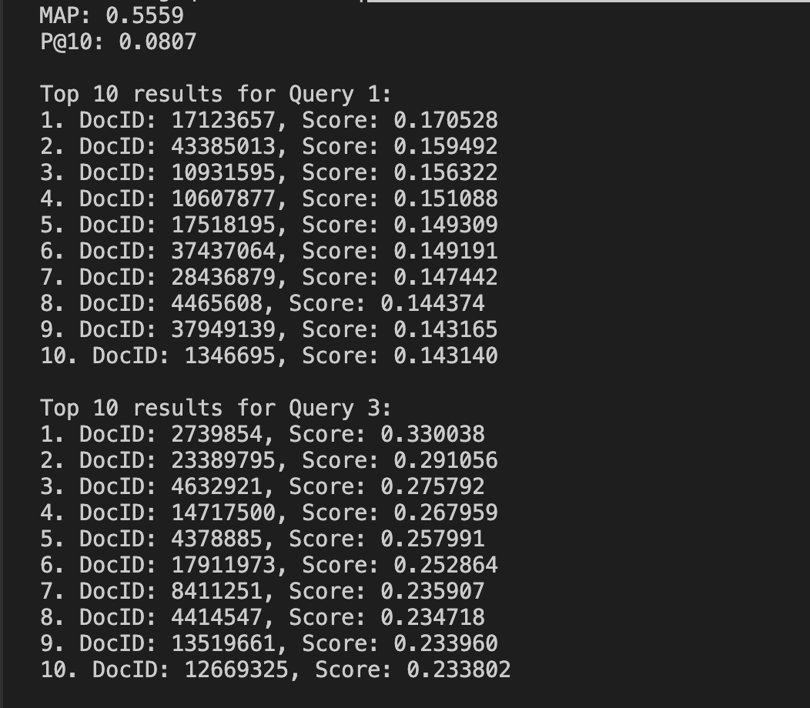

# Assignment 2 — Neural Information Retrieval System

**Course:** CSI4107 – Internet Retrieval  
**Assignment:** 2 – Neural Information Retrieval System
**Group Members:**  
- Cedric Luiz Dimatulac: 300171173
- Joseph Sreih: 300290385
- Tanner Frisch: 300294742  

**Division of Tasks:**  
- Cedric: Write report on findings
- Tanner: Neural reranking with all-MiniLM-L6-v2 model
- Joseph: Reranking using Doc2vec

---

## 1. Program Functionality

This project implements a two stage IR system

1. Classic IR:
- Same as in assignment 1
- Uses inverted index and cosine similarity

2. Neural Reranking
- Uses a neural model to rerank the top k candidates
- Tested with 3 models:
    - all-MiniLM-L6-v2
    - Doc2Vec
    - Model 3

### Reranking process
1. Encode query and top k candidate documents using the neural model
2. Normalize embeddings
3. Compute cosine similarity between query and document embeddings
4. Combine assignment 1 and the neural model scores 
5. Sort documents by final scores to produce the new ranked list

---

## Algorithms, Data Structures, and Results

### Assignment 1 IR
- Algorithm
    - Tokenize
    - remove stopwords
    - create inverted index
    - compute cosine similarity.
- Data structures
    - dict-of-dict inverted index
    - document frequency map.
- Optimizations
    - stopwords as a set
    - posting lists as Counter for constant lookup time and avoiding duplicates.

### Neural Reranking

### all-MiniLM-L6-v2
- Algorithm: Encode query/documents, compute cosine similarity, combine with normalized classical score.
- Data structures: numpy arrays for embeddings and final scores.
- Optimizations: precompute document embeddings, vectorized cosine similarity with NumPy.

### Doc2Vec
- Algorithm: Initial retrieval using cosine similiarity, then a reranking of the results using Doc2Vec which first generates embeddings for the docs and then uses them to calculate the final rankings by combining classical retrieval scores with neural similarity scores.
- Data structures: Numpy arrays for embedding and final score, lists and dictionarries. 
- Optimizaztions: Precomputing document embeddings, vector similarity computations using matrix operations.

### How to run Doc2Vec
- Make sure to have the following pip libraries installed:
```pip install numpy gensim tqdm```
- Run ```python3 run_neural2```

### Model 3

## Results

### Model 1 — all-MiniLM-L6-v2
MAP: 0.6285
P@10: 0.0920
The `Results` file shows that the neural reranker caused a significant improvement in the retrieval performance over the IR system from Assignment 1. For example, the top-ranked document for query 0 in the neural output has a score of `0.1660`, compared to a score of `0.0775` in the cosine-run. Overall, MAP increased from 0.51 to 0.6285, showing that the neural model was better at identifying relevant documents and pushes them higher in the ranking. This demonstrates that combining the classical IR system from Assignment 1 with neural embeddings produces more accurate results than classical IR alone.

### Model 2 — 
MAP: 0.5561 
P@10: 0.0807
Although not as big of an improvement as the all-MiniLM-L6-v2, Doc2Vec still gave a small improvement to the reranking. However, these scores varied depending on parameters inputted into the Doc2Vec model and the scores here represent the highest score I could get by playing around with the parameters (vector size, epochs, etc...).

### Query 1 and 3 Top 10 Results



### Model 3 — 
MAP:
P@10: 

---

## Notes
- Neural reranking performed better with full text, not preprocessed text. 
- Neural reranking also helped a lot in capturing semantic relationships between queries and documents.
- Alpha can be tuned to change the balance between neural and classical.
- Quality of performance varied depending on parameters set for neural models. Example: Vector size of 256 gave lower scores than a vector size of 1024 .
- Although having neural models can imporve accuracy, implementing a weaker model such as Doc2Vec for only an increase of roughly 0.03%-0.04% MAP score can be seen as unecessary. 
